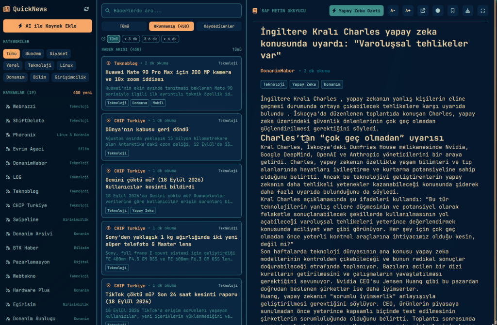
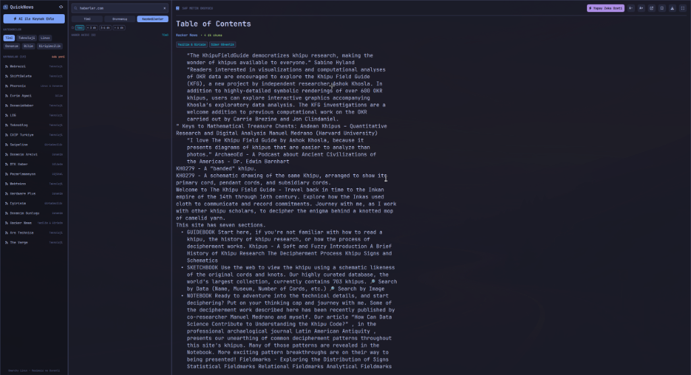
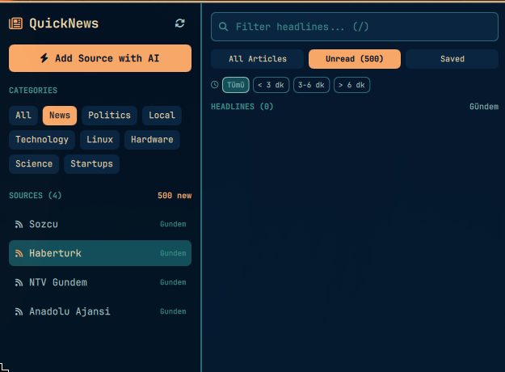

# QuickNews

[](https://github.com/ozdil)
[](https://buymeacoffee.com/ozdil)

A high-performance, open-source, 100% ad-free, distraction-free, and text-first news reader powered by Rust and Quickshell.

QuickNews delivers an uncompromising reading experience designed for developers, researchers, and minimalists. It strips away all visual clutter, clickbait traps, intrusive banner ads, tracking scripts, and cookie banners to present only clean typography and pure news text.

Initially engineered for Linux and the Omarchy desktop ecosystem, its decoupled Rust core engine operates independently of the frontend, providing a modular CLI tool alongside a native Wayland GUI.

[English](README.md) • [Türkçe](README.tr.md)

---

## Key Highlights

- **Open Source and Privacy-First:** 100% open source under the MIT License. Operates completely locally with zero telemetry, zero background tracking, and no external cloud dependency.
- **100% Ad-Free, Tracker-Free, and Image-Free:** DOM-level filtering strips away banner advertisements, cookie popups, sponsored widget links, newsletter modals, inline images (``), video embeds, and tracking query parameters (`utm_*`, `fbclid`, `gclid`).
- **Strict RSS / Atom XML Technology Guard:** QuickNews strictly enforces functional, modern RSS 2.0 and Atom XML standards. Before any source is registered, the engine actively tests the target endpoint. Dead links, 404 pages, and plain HTML redirections are rejected; only verified, functional XML streams are added.
- **Natural Language Source Discovery:** Add feeds effortlessly without manually digging for XML endpoints. Simply enter a natural language prompt such as `"Add top Linux news and tech blogs"` or `"Turkiye yerel sehir haberlerini ekle"`. The engine queries the knowledge base, probes candidate domains, verifies valid XML feeds, and registers them automatically.
- **Neutral 3-Point Summaries and De-Clickbaiting:** Analyzes long-form articles to produce a calm, factual neutral headline alongside a 3-bullet concise key takeaway.
- **Ergonomic Typography:** Standardized across all panels with `JetBrainsMono Nerd Font`. Features an 880px bounded reading column for optimal line-length and proportional line spacing (1.6) to prevent eye strain.
- **Live Desktop Theme Integration:** Monitors Omarchy's `colors.toml` configuration in real time; switching desktop color palettes updates the application interface instantly.
- **Hardened Security Architecture (HANCORE Standards):**
  - **SSRF Defense:** Prevents Server-Side Request Forgery by strictly blocking private (RFC 1918), link-local (RFC 3927), and loopback network addresses before socket connection.
  - **Bounded Payloads:** Hard buffer ceilings (8 MiB HTTP payload limit) prevent Denial-of-Service and memory ballooning attacks.
  - **Atomic Storage:** Configuration and article caches are written using temporary atomic files (`.tmp_*`) with strict `0600` file permissions and `0700` directory permissions. Symlinks are strictly rejected.

---

## Screenshots

### Main Interface
Three-pane minimalist layout with categories, feed headlines, and pure text reader:


### Article Reader and AI Summary
Distraction-free reading space with 3-bullet neutral summary:


### Natural Language Source Discovery
Add new feeds using natural language prompts without hunting for RSS links:


---

## Architecture Overview

```text
quicknews/
|-- Cargo.toml                      Rust manifest and engine dependencies
|-- CONTRIBUTING.md                 Contribution rules and HANCORE security standards
|-- README.md                       Project documentation and visual showcase
|-- PKGBUILD                        Arch Linux / Omarchy package specification
|-- install.sh                      Automated release compilation and installation script
|-- quicknews                       Main CLI launcher and IPC toggle script
|-- quicknews.desktop               XDG application desktop entry
|-- Panel.qml                       Omarchy Top Bar status widget
|-- assets/
|   `-- screenshots/                Visual interface assets
|-- src/
|   |-- lib.rs                      Core Rust library interface and sync orchestrator
|   |-- main.rs                     quicknews-engine CLI binary and IPC processor
|   `-- core/
|       |-- security.rs             SSRF validator, atomic file I/O, and DNS protection
|       |-- feed.rs                 RSS 2.0 / Atom XML parser, validation, and auto-discovery
|       |-- extractor.rs            Clean text extraction, ad removal, and pagination stitcher
|       |-- adblock.rs              URL tracking stripper and DOM cleaner
|       |-- ai.rs                   Natural language source resolution and NLP summarizer
|       `-- storage.rs              Atomic 0600/0700 file storage and cache management
`-- qml/
    |-- shell.qml                   Quickshell ShellRoot, Wayland FloatingWindow, and IPC
    |-- MainWindow.qml              Three-pane responsive user interface
    |-- components/
    |   |-- SourceSidebar.qml       Left pane: Source list, category filters, and deletion
    |   |-- HeadlineList.qml        Center pane: Filtered headlines, search, and reading times
    |   |-- ArticleReader.qml       Right pane: Clean reading area with font size controls
    |   `-- AddSourceModal.qml      Natural language source discovery dialog
    `-- theme/
        |-- Theme.qml               Dynamic colors.toml palette and JetBrainsMono font
        `-- I18n.qml                Dual-language localization engine (English US / Turkish)
```

---

## Features

### Pure Text-First Reading
- All images, video embeds, iframes, and promotional widgets are stripped at the parser level.
- Preserves article headings (`## Subheadings`), numbered lists, bullet points, and clean paragraphs.
- Estimated reading times calculated dynamically based on clean word counts.

### Verified Feed Ingestion
- Actively verifies candidate feed URLs before saving.
- Rejects dead links, 404 redirections, and non-XML web pages.
- Probes domain fallbacks (`/feed`, `/rss`, `/rss/news`, `/atom.xml`) when an obsolete URL is provided.
- Compatible with RSS 2.0, RSS 0.9x, and Atom 1.0 specifications.

### Offline Extractive NLP and AI Summarization
- Includes a fast, deterministic local extractive NLP summarizer that operates completely offline.
- Optionally integrates with local Ollama or Google Gemini APIs when keys are configured.
- Neutralizes sensationalized and clickbait titles into informative headlines.

### Dual-Language Localization
- Auto-detects system locale (`LANG`, `LC_ALL`, `LC_MESSAGES`).
- Defaults to English (US) on standard setups, with automatic Turkish support on Turkish systems.
- Dynamically formats dates according to the active locale (e.g. `"September 18, 2026, 14:00"` / `"18 Eylul 2026, 14:00"`).

---

## Command-Line Interface (CLI)

The `quicknews-engine` binary can be operated entirely from the terminal without launching the graphical interface:

```bash
# Synchronize all active feeds
quicknews sync

# List latest synchronized articles
quicknews list

# Read clean, ad-free article text in the terminal
quicknews read "<Article URL>"

# Generate a neutral headline and 3-bullet summary
quicknews summarize "<Article URL>"

# Discover and add feeds using a natural language prompt
quicknews add-prompt "Add top technology and Linux blogs"

# Add a specific feed with strict XML verification
quicknews add-source "Source Name" "domain.com" "https://domain.com/feed" "Technology"

# Remove a feed and purge its cached articles
quicknews remove-source "domain.com"

# Display registered feeds
quicknews sources

# Output system and feed status as JSON
quicknews status
```

---

## Keyboard Shortcuts

| Shortcut | Description |
| :--- | :--- |
| `j` / `Down` | Move to next article |
| `k` / `Up` | Move to previous article |
| `Enter` / `Space` | Open selected article |
| `/` | Focus search and filter input |
| `Escape` | Clear search / Dismiss modal / Hide window |
| `+` / `=` | Increase font size |
| `-` / `_` | Decrease font size |
| `0` | Reset font size to default |
| `m` | Mark current article as read |
| `z` | Toggle Zen Mode (fullscreen reading view) |
| `r` | Refresh and synchronize feeds |
| `q` | Hide QuickNews window |

---

## Installation

### Prerequisites
- Linux (Wayland recommended, X11 supported)
- Rust toolchain (1.75+)
- Quickshell (0.1.0+)
- `JetBrainsMono Nerd Font`

### Automated Build and Installation
Run the installer script to compile the release binary, set up desktop entries, and install panel components:

```bash
git clone https://github.com/ozdil/quicknews.git
cd quicknews
git checkout 1bacb2a2cb2b21c0019eddd947d594906c5ab583
./install.sh
```

To run the application:
```bash
quicknews
```

---

## Security and Integrity

QuickNews is built following strict HANCORE Linux system standards:
- **Zero Unicode Emojis:** All source code, logs, commits, documentation, and user interfaces maintain a strict zero-emoji policy.
- **Process Isolation:** Background tasks run in segregated process groups with RAII cleanup guards.
- **Strict File Permissions:** Configuration and data stores are restricted to `0600` file permissions and `0700` directory permissions.
- **Safe I/O Buffering:** All network operations use hard size limits to protect system resources.

---

## Support & Sponsorship

If you find QuickNews useful for your daily distraction-free news reading and want to support its ongoing development, consider buying a coffee:

<a href="https://buymeacoffee.com/ozdil" target="_blank">
  
</a>

---

## License

This project is licensed under the MIT License. See [LICENSE](LICENSE) for details.
